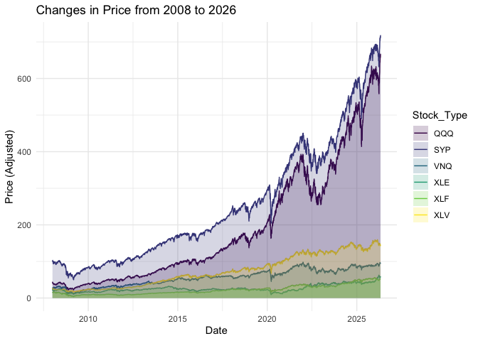
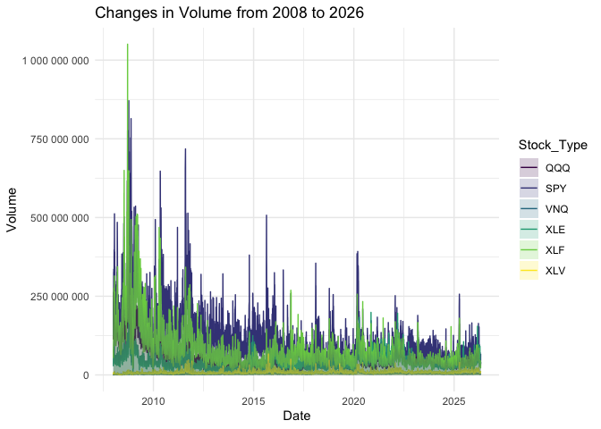

# README


## Questions of Interest:

This research project will look at exploring the relationship between
the daily volatility in price in different industry’s Exchange Traded
Funds (ETFs), and how trading volume impacts it during financial crises.
For this analysis, I pulled the ‘SFY’ ETF, which tracks the S&P 500 (500
largest companies in the US Stock Market), ‘QQQ’ which tracks Companies
within the technology sector in the S&P, ‘XLV’ tracks the Health Care
Sector, ‘XLF’ tracks Financial Sector, ‘XLE’ tracks Energy Sector, and
‘VNQ’ (Tracks Real Estate Sector.

## Data:

The data was taken from the ‘quantmod()’ package, which scrapes data
Price and Volume data from YahooFinance. Questions of Interest:

``` r
## loading and cleaning the data: 
## "install.packages("quantmod")

library(quantmod)
library(lubridate)
library(tidyverse)

start <- ymd("2008-01-01")
end <- ymd("2026-05-01")

## getting symbols of the ETFs
getSymbols(c("SPY", "QQQ", "XLV", "XLF", "XLE", "VNQ"), src = "yahoo",
           from = start, to = end)

date_tib <- as_tibble(index(SPY)) |>
  rename(start_date = value)

qqq_tib <- as_tibble(QQQ)
spy_tib <- as_tibble(SPY)
xlv_tib <- as_tibble(XLV)
xlf_tib <- as_tibble(XLF)
xle_tib <- as_tibble(XLE)
vnq_tib <- as_tibble(VNQ)

all_stocks <- bind_cols(date_tib, qqq_tib, spy_tib, xlv_tib, xlf_tib, xle_tib, vnq_tib)

## cleaning the data
stocks_long <- all_stocks |>
  dplyr::select(start_date, SPY.Adjusted, QQQ.Adjusted, XLV.Adjusted, XLF.Adjusted,
                XLE.Adjusted, VNQ.Adjusted) |>
  pivot_longer(2:7, names_to = "Stock_Type", values_to = "Price") |>
  mutate(Stock_Type = fct_recode(Stock_Type,
                                 SYP = "SPY.Adjusted",
                                 QQQ = "QQQ.Adjusted",
                                 XLV = "XLV.Adjusted", 
                                 XLF = "XLF.Adjusted", 
                                 XLE = "XLE.Adjusted", 
                                 VNQ = "VNQ.Adjusted"
                                 ))

## tibble for each of the ETFs
stocks_qqq <- stocks_long |> filter(Stock_Type == "QQQ")
stocks_spy <- stocks_long |> filter(Stock_Type == "SYP")
stocks_xlv <- stocks_long |> filter(Stock_Type == "XLV")
stocks_xlf <- stocks_long |> filter(Stock_Type == "XLF")
stocks_xle <- stocks_long |> filter(Stock_Type == "XLE")
stocks_vnq <- stocks_long |> filter(Stock_Type == "VNQ")

## looking at volume
library(scales)

stocks_volume <- all_stocks |>
  dplyr::select(start_date, QQQ.Volume, SPY.Volume, XLV.Volume, XLF.Volume,
                XLE.Volume, VNQ.Volume) |>
  pivot_longer(2:7, names_to = "Stock_Type", values_to = "Volume") |>
  mutate(Stock_Type = fct_recode(Stock_Type,
                                 QQQ = "QQQ.Volume",
                                 SPY = "SPY.Volume",
                                 XLV = "XLV.Volume", 
                                 XLF = "XLF.Volume", 
                                 XLE = "XLE.Volume", 
                                 VNQ = "VNQ.Volume"
                                 ))
```

## Visualizations:

``` r
## comparing price through time
ggplot(data = stocks_long, aes(x = start_date, y = Price)) +
  geom_line(aes(colour = Stock_Type)) +
  geom_area(aes(fill = Stock_Type), alpha = 0.2, position = "identity") +
  theme_minimal() +
  scale_colour_viridis_d() +
  scale_fill_viridis_d() + 
  labs(title = "Changes in Price from 2008 to 2026",
       y = "Price (Adjusted)",
       x = "Date")
```



``` r
## comparing volume throught time 
ggplot(data = stocks_volume, aes(x = start_date, y = Volume)) +
  geom_line(aes(colour = Stock_Type)) +
  geom_area(aes(fill = Stock_Type), alpha = 0.2, position = "identity") +
  theme_minimal() +
  scale_colour_viridis_d() +
  scale_fill_viridis_d() + 
  scale_y_continuous(labels = label_number()) + 
  labs(title = "Changes in Volume from 2008 to 2026",
       y = "Volume",
       x = "Date")
```


